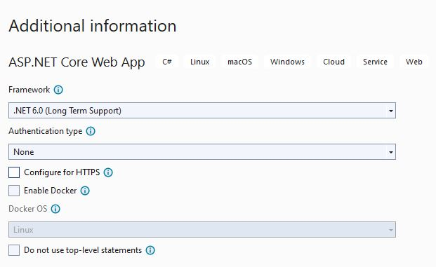

# The CRASH course into a *fraction* of containerization
The world of containerization is massive with lots of learning. This workshop hopes to remove the intimidation factor by letting you work through a meaningful number of pieces but thinly sliced. The pieces:
1) Getting an application into Docker and seeing it work
2) Using a handful of Docker commands
3) Getting an application into Kubernetes and seeing it work
4) Using a handful of Kubernetes commands
5) Utilize Helm to deploy into Kubernetes
6) Using a handful of Helm commands
7) **You are inspired to learn all there is about containerization !!!**

## Prerequisites
1) Install [Visual Studio](https://visualstudio.microsoft.com/downloads/) `(You will need to create a simple test web application)`
2) Install [Docker Desktop](https://www.docker.com/products/docker-desktop/)
3) Install [Visual Studio Code](https://code.visualstudio.com/)
4) Install [Docker extension for VS Code](https://marketplace.visualstudio.com/items?itemName=ms-azuretools.vscode-docker)
5) Install [Kubernetes extension for VS Code](https://marketplace.visualstudio.com/items?itemName=ms-kubernetes-tools.vscode-kubernetes-tools)


## Create a simple test web application
1) Launch **Visual Studio** and create an ASP.NET Core Web Application named `MyWebApp`




2) Add some code and run the application from **Visual Studio**


3) Publish the application via the Build menu option


## Getting the application into Docker and seeing it work
1) Launch **Visual Studio Code**
2) Open the folder containing your application csproj via the File menu option 


3) Using the left area - EXPLORER, create a new file named `Dockerfile` and add the following code (of course save after).
```
FROM mcr.microsoft.com/dotnet/aspnet:6.0

COPY /bin/Release/net6.0/publish/ App/
WORKDIR /App
ENTRYPOINT ["dotnet", "MyWebApp.dll"]
```
4) Using the left area - EXPLORER, create a new file named `docker-compose.yml` and add the following code (of course save after).
```
version: "3"
services:
    mywebapp:
        build: .
        image: imageorigin:v1
        container_name: containerorigin
        ports:
            - 86:80
        networks:
          - network

networks:
  network: {}
```
5) Confirm **Docker Desktop** is running in the System Tray area
6) Start a New Terminal via the Terminal menu option
7) Run the following Docker command
```
docker-compose up -d
```


8) Once the command completes. Click on the Docker extension icon.


9) Notice that the container is running. Right-click on the container and select the Open in Brower option. You should now see your application web page at the address: http://localhost:86/. That `86` is from your `docker-compose.yml` where you specify the external port to expose the stuff running inside the container. The `80` is the default http port that web applications use and is termed the internal port that the container uses to *talk* to the application.

## Using a handful of Docker commands
1) In the Terminal window. Run the following command
```
docker images
```
2) In the Terminal window. Run the following command
```
docker ps
```
3) In the Terminal window. Run the following command
```
docker-compose down
```
4) Refresh the CONTAINERS area. Notice that the container is gone and if you refresh your web page it no longer works.
5) In the Terminal window. Run the following command
```
docker-compose up -d
```
6) Refresh the CONTAINERS area. Refresh the web page.
7) In the Terminal window. Run the following command
```
docker-compose down
```
8) The image (of the application) is needed for the next steps.

## Getting the application into Kubernetes and seeing it work
1) Launch **Docker Desktop** and Enable Kubernetes via Settings


2) Kubernetes requires the use of a [registry server](https://docs.docker.com/registry/deploying/). Run the following Docker command
```
docker run -d -p 5000:5000 --restart=always --name registry registry:2
```
3) Copy the application image to the registry. Run the following Docker commands
```
docker tag imageorigin:v1 localhost:5000/imgorigin
docker push localhost:5000/imgorigin
```
4) With the application image now in the registry. Clean up the other images. Run the following commands
```
docker image remove imageorigin:v1
docker image remove localhost:5000/imgorigin
```

### (Minor Tangent) Curl for your pleasure. Wait! What?
  - Get the image from the register. Run the following Docker command
    ```
    docker pull localhost:5000/imgorigin
    ```
  - Spin up a container for the application. Run the following Docker command
    ```
    docker run -d --name testcurl -p 8080:80 localhost:5000/imgorigin
    ```
  - Test the web page and note the port number 8080. Run the following command
    ```
    curl http://localhost:8080/
    ```
  - Learn [curl](https://github.com/curl/curl)
  - Clean up! Don't worry! The registry still has the original image. Run the following command
    ```
    docker stop testcurl
    docker rm testcurl
    docker image remove localhost:5000/imgorigin
    ```

### Back to the business of Kubernetes
5) Using the left area - EXPLORER, create a new folder named `k8s`
6) Create a new file `deploy.yaml` under `k8s` and add the following content
```
apiVersion: apps/v1
kind: Deployment
metadata:
  name: io-deployment
  labels:
    app: io
spec:
  replicas: 2
  selector:
    matchLabels:
      app: io
  template:
    metadata:
      labels:
        app: io
    spec:
      containers:
      - name: io
        image: localhost:5000/imgorigin
        ports:
        - containerPort: 80 # this is the port exposed by your application via dockerfile
```
7) Create a new file `service.yaml` under `k8s` and add the following content
```
apiVersion: v1
kind: Service
metadata:
  name: io-service
spec:
  selector:
    app: io # this need to match spec -> selector -> matchLabels used in the deployment
  ports:
  - protocol: TCP
    port: 8085 # this is the port for others in the cluster to talk to me
    targetPort: 80 # this is the port from the deployment and what the pods are exposed on
```
8) Create a new file `ingress.yaml` under `k8s` and add the following content
```
apiVersion: networking.k8s.io/v1
kind: Ingress
metadata:
  name: io-ingress
spec:
  ingressClassName: nginx
  rules:
  - host: foo.bar.com # add this entry to your host file - 127.0.0.1 foo.bar.com
    http:
      paths:
        - path: /
          pathType: Prefix # https://pet2cattle.com/2021/04/ingress-pathtype
          backend:
            service:
             name: io-service # this is the name of the service
             port:
                number: 8085 # this is the service's cluster port exposed to be talked to a lot
```

## Using a handful of Kubernetes commands
- [K8s Reference](https://kubernetes.io/docs/reference/kubectl/cheatsheet/)

1) Deploy the application. Run the following kubectl command
```
kubectl apply -f .\deploy.yaml
```
2) Deploy the service to expose the application. Run the following kubectl command
```
kubectl apply -f .\service.yaml
```
3) Run the following kubectl command
```
kubectl get all
```


4) Click on the Kubernetes extension and expand the Services


5) Right-click on an entry `io-deployment...` and select Port Forward from the options menu. Use port 8080 for LOCAL.
6) Navigate to the application web page at the http://localhost:8080

Congrats !!! Your application is working in Kubernetes. But there is more...

We should be accessing our application via a URL. Ingress time...
- https://github.com/kubernetes/ingress-nginx
- https://kubernetes.github.io/ingress-nginx/deploy/

7) At the time of this writing, the version is 1.5.1
    - please use the latest version if the below does not work
    - the url will be almost the same except for the version info part
```
kubectl apply -f https://raw.githubusercontent.com/kubernetes/ingress-nginx/controller-v1.5.1/deploy/static/provider/cloud/deploy.yaml
```

8) Add the following to your system hosts file
```
127.0.0.1 foo.bar.com
```


9) Deploy the ingress to allow url navigation to the application. Run the following kubectl command
```
kubectl apply -f .\ingress.yaml
```

10) Launch your web browser and navigate to http://foo.bar.com/


11) Keep your web browser open. Click on the Kubernetes extension and expand the Services
12) Right-click on an entry `io-deployment...` and select Delete Now from the option menu
13) Do this deleting a few times and Refresh your web browser still on http://foo.bar.com/

## *(cue the dramatic music)* **THE POWER OF KUBERNETES !!!** 


14) Keep your web browser open. Run the following kubectl commands. Then refresh your web browser.
```
kubectl delete -f .\ingress.yaml
kubectl delete -f .\service.yaml
kubectl delete -f .\deploy.yaml
```

### [Install Helm](https://helm.sh/docs/intro/install/)
1) Download the binary from https://github.com/helm/helm/releases
2) Unzip the binary to a directory on your system, such as `C:\Helm`
3) Add the local Helm directory to your PATH.

## Utilize Helm to deploy into Kubernetes
1) Using the left area - EXPLORER, create a new folder named `helmstuffhere` and a subfolder named `templates`
2) Copy the files from the `k8s` folder to the `templates` folder
3) Create a new file `Chart.yaml` under the `helmstuffhere` folder and add the following content
```
apiVersion: v2
name: io-release
description: A Helm chart for mywebapp
type: application

# This is the chart version. This version number should be incremented each time you make changes
# to the chart and its templates, including the app version.
version: 1.0.0

# This is the version number of the application being deployed. This version number should be
# incremented each time you make changes to the application.
appVersion: 2024.1.0
```


## Using a handful of Helm commands
1) Start a New Terminal via the Terminal menu option
2) Navigate to the path of the parent folder of the `helmstuffhere` folder
3) Run the following helm command to **preview** what will be installed by helm
```
helm template io-release helmstuffhere
```
4) Run the following helm command to install the application into Kubernetes
```
helm install io-release helmstuffhere
```
5) Run the following helm command to see the helm history
```
helm history io-release
```

6) Click on the Kubernetes extension and explore what has been installed. Try http://foo.bar.com/ in your web browser or use curl

### Why use helm?
1) Go back to your application source code and edit the `/Pages/Index.cshtml.cs` file
```
public void OnGet()
{
    ViewData["Name"] = "CRASH COURSE";
}
```
2) Publish the application via the Build menu option
3) Build a new version of the application image
```
docker build -t imageorigin:v2 .
```
4) Copy the application image to the registry
```
docker tag imageorigin:v2 localhost:5000/imgoriginv2
docker push localhost:5000/imgoriginv2
```
5) With the application image now in the registry. Clean up the other images
```
docker image remove imageorigin:v2
docker image remove localhost:5000/imgoriginv2
```
6) Edit the deployment file at `/helmstuffhere/templates/deploy.yaml` to use the new image
```
image: localhost:5000/imgoriginv2
```
7) Edit the chart file at `/helmstuffhere/Chart.yaml` to reflect the new version of our application
```
apiVersion: v2
name: io-release
description: A Helm chart for my applications
type: application

# This is the chart version. This version number should be incremented each time you make changes
# to the chart and its templates, including the app version.
version: 1.0.1

# This is the version number of the application being deployed. This version number should be
# incremented each time you make changes to the application.
appVersion: 2022.1.1
```
8) Run the following helm command to install the new application version - UPGRADE
```
helm upgrade io-release helmstuffhere
```
9) Run the following helm command to see the helm history
```
helm history io-release
```
10) Try http://foo.bar.com/ in your web browser and see the CRASH COURSE change


11) Let's rollback the application to the previous version
```
helm rollback io-release 1
```
12) Run the following helm command to see the helm history
```
helm history io-release
```
13) Try http://foo.bar.com/ in your web browser

## *(cue the dramatic music)* **THE POWER OF HELM !!!** 
## ...all the best on your journey into containerization...
# ...see you out there...
