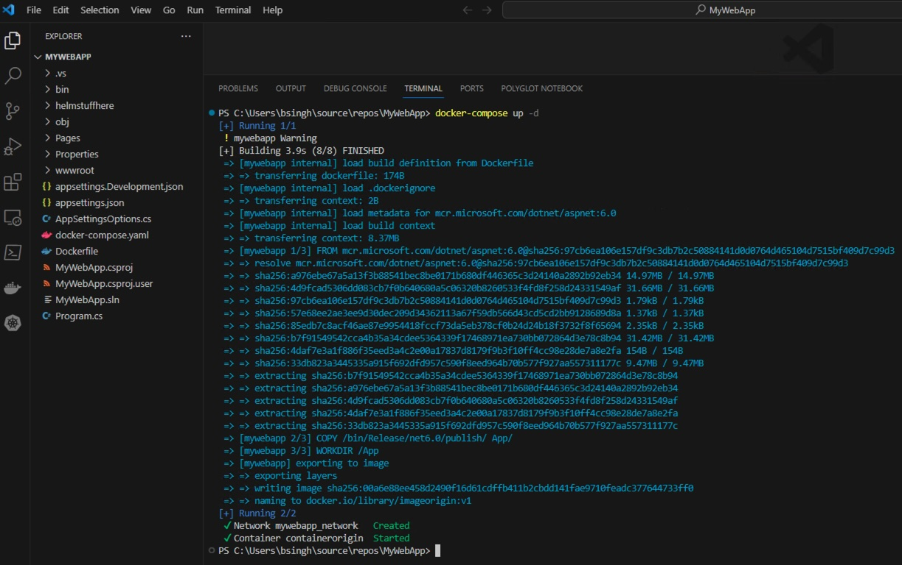

# The CRASH course on Application Configuration Settings in the Helm world
Two strengths of Helm that eliminate the risk of deployment errors are:
1) Easy management of application configuration settings
2) Easy management of deployment recipes

This workshop will focus on - Application Configuration Settings

**Jump In !!! - The water is fine...**

## Prerequisites
1) Install [Visual Studio](https://visualstudio.microsoft.com/downloads/) `(You will need to create a simple test web application)`
2) Install [Docker Desktop](https://www.docker.com/products/docker-desktop/)
3) Install [Visual Studio Code](https://code.visualstudio.com/)
4) Install [Docker extension for VS Code](https://marketplace.visualstudio.com/items?itemName=ms-azuretools.vscode-docker)
5) Install [Kubernetes extension for VS Code](https://marketplace.visualstudio.com/items?itemName=ms-kubernetes-tools.vscode-kubernetes-tools)

### [Install Helm](https://helm.sh/docs/intro/install/)
1) Download the binary from https://github.com/helm/helm/releases
2) Unzip the binary to a directory on your system, such as `C:\Helm`
3) Add the local Helm directory to your PATH.

## Create a simple test web application
1) Launch **Visual Studio** and create an ASP.NET Core Web Application named `MyWebApp`


2) Add some code and run the application from **Visual Studio**

    1) Create the following class file - **AppSettingsOptions.cs**
        ```
        public class AppSettingsOptions
        {
          public const string SectionName = "AppSettings";
          public string DisplayName { get; set; } = null!;
          public string DatabaseConnection { get; set; } = null!;
        }
        ```
    2) Make the following changes to **Index.cshtml**

    

    3) Make the following changes to **Index.cshtml.cs**

    

    4) Make the following changes to **appsettings.json**

    

    5) Create the following Env Var - **LEARN_HELM_LINK** with value: **https://www.google.com/search?q=helm**

    

    6) Run the application via **Visual Studio**

    

3) Publish the application via the Build menu option

## Getting ready for Docker
1) Launch **Visual Studio Code**
2) Open the folder containing your application csproj via the File menu option
3) Using the left area - EXPLORER, create a new file named `Dockerfile` and add the following code (of course save after).
    ```
    FROM mcr.microsoft.com/dotnet/aspnet:6.0

    COPY /bin/Release/net6.0/publish/ App/
    WORKDIR /App
    ENTRYPOINT ["dotnet", "MyWebApp.dll"]
    ```
4) Using the left area - EXPLORER, create a new file named `docker-compose.yml` and add the following code (of course save after).
    ```
    version: "3"
    services:
        mywebapp:
            build: .
            image: imageorigin:v1
            container_name: containerorigin
            ports:
                - 86:80
            networks:
              - network

    networks:
      network: {}
    ```
5) Confirm **Docker Desktop** is running in the System Tray area
6) Start a New Terminal via the Terminal menu option
7) Run the following Docker command
    ```
    docker-compose up -d
    ```

    

8) Once the command completes. Click on the Docker extension icon.


9) Notice that the container is running. Right-click on the container and select the Open in Brower option. You should now see your application web page at the address: http://localhost:86/. That `86` is from your `docker-compose.yml` where you specify the external port to expose the stuff running inside the container. The `80` is the default http port that web applications use and is termed the internal port that the container uses to *talk* to the application.

10) In the Terminal window. Run the following command
    ```
    docker-compose down
    ```
11) The image (of the application) is needed for the next steps.

## Getting ready for Kubernetes
1) Launch **Docker Desktop** and Enable Kubernetes via Settings


2) Kubernetes requires the use of a [registry server](https://docs.docker.com/registry/deploying/). Run the following Docker command
    ```
    docker run -d -p 5000:5000 --restart=always --name registry registry:2
    ```
3) Copy the application image to the registry. Run the following Docker commands
    ```
    docker tag imageorigin:v1 localhost:5000/imgorigin
    docker push localhost:5000/imgorigin
    ```
4) With the application image now in the registry. Clean up the other images. Run the following commands
    ```
    docker image remove imageorigin:v1
    docker image remove localhost:5000/imgorigin
    ```

## Deployment Recipe (Visual Studio Code)
1) Using the left area - EXPLORER, create a new folder named `helmstuffhere` and a subfolder named `templates`

2) Create a new file `configmap.yaml` under `templates` and add the following content
    ```
    apiVersion: v1
    kind: ConfigMap
    metadata:
      name: app-config
    data:
      AppSettings__DisplayName:  {{ .Values.appSettings.displayName | quote }}
      AppSettings__DatabaseConnection:  {{ .Values.appSettings.databaseConnection | quote }}
    ```

3) Create a new file `deploy.yaml` under `templates` and add the following content. 
**Please note the entries on Line 22 and 25 that is how our configuration settings are passed to the container running the application.**

    ```
    apiVersion: apps/v1
    kind: Deployment
    metadata:
      name: io-deployment
      labels:
        app: io
    spec:
      replicas: 2
      selector:
        matchLabels:
          app: io
      template:
        metadata:
          labels:
            app: io
        spec:
          containers:
          - name: io
            image: localhost:5000/imgorigin
            ports:
            - containerPort: 80 # this is the port exposed by your application via dockerfile
            envFrom:
              - configMapRef:
                  name: app-config
            env:
            - name: LEARN_HELM_LINK
              value: {{ .Values.learn_helm_link | quote }}
    ```
4) Create a new file `service.yaml` under `templates` and add the following content
    ```
    apiVersion: v1
    kind: Service
    metadata:
      name: io-service
    spec:
      selector:
        app: io # this need to match spec -> selector -> matchLabels used in the deployment
      ports:
      - protocol: TCP
        port: 8085 # this is the port for others in the cluster to talk to me
        targetPort: 80 # this is the port from the deployment and what the pods are exposed on
    ```
5) Create a new file `ingress.yaml` under `templates` and add the following content
    ```
    apiVersion: networking.k8s.io/v1
    kind: Ingress
    metadata:
      name: io-ingress
    spec:
      ingressClassName: nginx
      rules:
      - host: foo.bar.com # add this entry to your host file - 127.0.0.1 foo.bar.com
        http:
          paths:
            - path: /
              pathType: Prefix # https://pet2cattle.com/2021/04/ingress-pathtype
              backend:
                service:
                 name: io-service # this is the name of the service
                 port:
                    number: 8085 # this is the service's cluster port exposed to be talked to a lot
    ```
6) We will be accessing our application via a URL using an ingress
    - https://github.com/kubernetes/ingress-nginx
    - https://kubernetes.github.io/ingress-nginx/deploy/

7) At the time of this writing, the version is 1.5.1
    - please use the latest version if the below does not work
    - the url will be almost the same except for the version info part
      ```
      kubectl apply -f https://raw.githubusercontent.com/kubernetes/ingress-nginx/controller-v1.5.1/deploy/static/provider/cloud/deploy.yaml
      ```

8) Run the above command to set up the ingress controller

9) Add the following to your system hosts file
    ```
    127.0.0.1 foo.bar.com
    ```
    
    


## Configuration Settings (Visual Studio Code)
1) Create a new file `Chart.yaml` under the `helmstuffhere` folder and add the following content
    ```
    apiVersion: v2
    name: io-release
    description: A Helm chart for mywebapp
    type: application

    # This is the chart version. This version number should be incremented each time you make changes
    # to the chart and its templates, including the app version.
    version: 1.0.0

    # This is the version number of the application being deployed. This version number should be
    # incremented each time you make changes to the application.
    appVersion: 2024.1.0
    ```

2) Create a new file `values.yaml` under the `helmstuffhere` folder and add the following content
    ```
    appSettings:
      displayName: "A rose by any other name would smell as sweet"
      databaseConnection: "Server=someSrv;Database=theDB;User Id=starlord;Password=who;"
    learn_helm_link: "https://helm.sh/docs/intro/quickstart/"
    ```

## Helm commands to deploy application
1) Start a New Terminal via the Terminal menu option
2) Navigate to the path of the parent folder of the `helmstuffhere` folder
3) Run the following helm command to **preview** what will be installed by helm
    ```
    helm template io-release helmstuffhere
    ```
4) Run the following helm command to install the application
    ```
    helm install io-release helmstuffhere
    ```
5) Run the following helm command to see the helm history
    ```
    helm history io-release
    ```

6) Click on the Kubernetes extension icon in **Visual Studio Code** and explore what has been installed. 

7) Try http://foo.bar.com/ in your web browser


